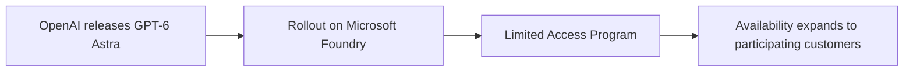

**GPT-6 Astra**, OpenAI's newest frontier model, has begun rolling out on **Microsoft Foundry** through the Limited Access Program, with availability expanding to participating customers in the days following the announcement.

## How the rollout works

## Context: optimizing the cost of agents

In the same period, Azure published the **"The Economics of Agent Optimization"** series, focused on how context engineering in Microsoft Foundry helps lower AI costs by improving knowledge retrieval, tool selection, memory, and agent performance at scale.

- Source: [GPT-6 Astra: Frontier intelligence for work, now generally available in Microsoft Foundry](https://azure.microsoft.com/en-us/blog/gpt-6-astra-frontier-intelligence-for-work-now-generally-available-in-microsoft-foundry/)
- Further reading: [The Economics of Agent Optimization: Context engineering for enterprise AI agents](https://azure.microsoft.com/en-us/blog/the-economics-of-agent-optimization-context-engineering-for-enterprise-ai-agents/)
- Official documentation: [Microsoft Foundry](https://azure.microsoft.com/en-us/products/ai-foundry/)
