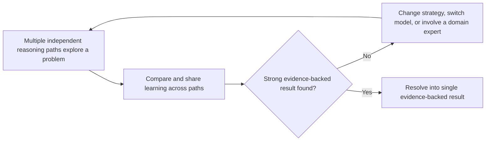

Microsoft reported that **Microsoft Discovery Engine with CLIO** (Cognitive Loop via In-Situ Optimization) achieved the highest scores among agentic harnesses evaluated on **Agent's Last Exam**, a demanding benchmark of long-running, tool-using professional tasks across three scientific domains.

## Benchmark results

- **61.6%** in health and medicine
- **75.2%** in physical sciences
- **64.6%** in life sciences

## How CLIO's adaptive reasoning works

CLIO is designed to determine when to keep exploring, change strategy, use a different model, or bring a human domain expert into the loop — rather than stopping at a single model response.

## Real-world impact

Beyond the benchmark, Discovery Engine with CLIO has already supported real R&D work, including the discovery of a **novel organic redox flow battery**, and is positioned for use in materials and molecular discovery, formulation and process optimization, and lab automation.

- Source: [Beyond the benchmark: How an adaptive approach drives scientific discovery](https://azure.microsoft.com/en-us/blog/beyond-the-benchmark-how-an-adaptive-approach-drives-scientific-discovery/)
- Official documentation: [Microsoft Discovery Engine](https://learn.microsoft.com/en-us/azure/microsoft-discovery/concept-discovery-engine)
