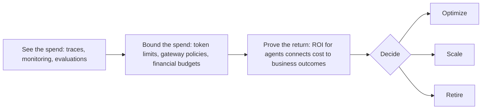

Microsoft published the fourth and final post in its **"The Economics of Agent Optimization"** series, focused on governing AI agent spend on **Microsoft Foundry**.

## The governance cycle

## Three layers of spend limits

1. **Foundry Control Plane** enforces tokens-per-minute rate limits and total token quotas at the project scope — requests over the limit get a `429 Too Many Requests`, exhausted quotas get `403 Forbidden`.
2. **Azure API Management's AI Gateway** applies the `llm-token-limit` policy across models and providers (OpenAI-compatible APIs, the Anthropic Messages API, MCP servers, agent-to-agent APIs).
3. **Microsoft Cost Management budgets** use actual Azure billing data for financial accountability and escalation, complementing the earlier, faster token-based controls.

## Proving ROI

**ROI for agents in Foundry**, currently in private preview, connects agent costs to defined business outcomes (e.g., task completion, customer satisfaction, case deflection), calculating **value generated**, **total cost**, **net value**, and **ROI** per agent.

- Source: [The Economics of Agent Optimization: How AI agent governance controls cost and proves ROI](https://azure.microsoft.com/en-us/blog/the-economics-of-agent-optimization-how-ai-agent-governance-controls-cost-and-proves-roi/)
- Official documentation: [Manage costs in Microsoft Foundry](https://learn.microsoft.com/en-us/azure/foundry/concepts/manage-costs)
