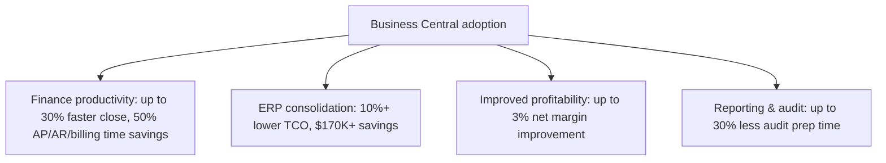

Microsoft commissioned a **Forrester Total Economic Impact™ (TEI) study**, based on interviews with four Business Central customers aggregated into a composite organization ($50M annual revenue, 300 employees), to quantify the financial impact of modernizing on **Dynamics 365 Business Central**.

## Projected results over three years

- **More than 200% return on investment (ROI)**
- **~$460K net present value (NPV)**
- **Payback in as little as six months**
- More than **$680K in three-year, risk-adjusted present value benefits** in total

## Where the value comes from

The study notes that AI benefits were **not independently quantified**, but interviewees reported that unified data and processes in Business Central accelerate the adoption of Copilot-supported approvals, variance analysis, and exception handling — positioning Business Central as an **AI-ready ERP foundation** for Microsoft 365 Copilot and intelligent agents.

- Source: [Enable accelerated growth with confidence: A Forrester TEI study projects more than 200% ROI over three years and six-month payback using Dynamics 365 Business Central](https://www.microsoft.com/en-us/dynamics-365/blog/business-leader/2026/03/31/enable-accelerated-growth-with-confidence-a-forrester-tei-study-projects-more-than-200-roi-over-three-years-and-six-month-payback-using-dynamics-365-business-central/)
- Full study: [Forrester Total Economic Impact™ of Dynamics 365 Business Central](https://aka.ms/BCTEIReport)
