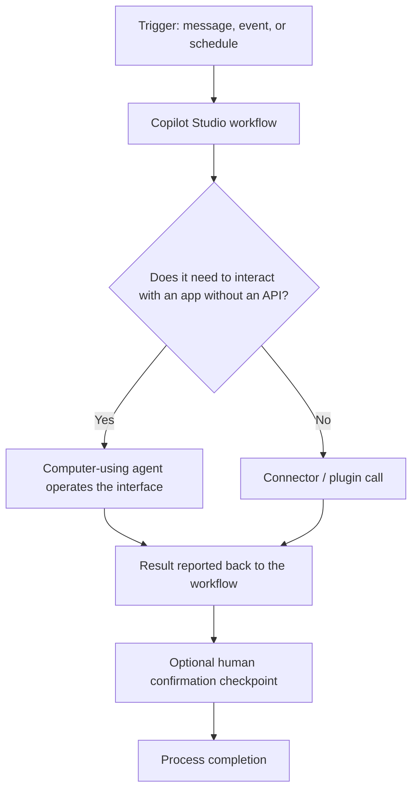

The May 2026 update to **Microsoft Copilot Studio** brings **computer-using agents** (agents able to operate directly on application interfaces the way a person would) to general availability, along with a **new workflow design experience** and **real-time voice** capabilities.

## The flow of an agent with workflows and computer use

## Why it matters

Computer-using agents extend automation to systems without modern APIs, while the new workflow design aims to make the sequence of steps an agent executes more readable, including integrations with **Work IQ** mentioned in the same announcement.

- Source: [New and improved: Computer-using agents, a new workflows experience, and real-time voice experiences](https://www.microsoft.com/en-us/microsoft-copilot/blog/copilot-studio/new-and-improved-computer-using-agents-a-new-workflows-experience-and-real-time-voice-experiences/)
- Official documentation: [Microsoft Copilot Studio documentation](https://learn.microsoft.com/en-us/microsoft-copilot-studio/)
