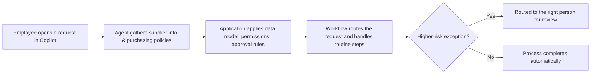

Microsoft has announced the **fifth annual Power Platform Community Conference (PPCC)**, taking place **October 27–29, 2026 at the MGM Grand in Las Vegas**, dedicated to how Microsoft Copilot, Work IQ, agents, apps, and workflows can improve business processes.

## A concrete example: rethinking a procurement process

The announcement illustrates how these pieces fit together with a procurement scenario:

## What to expect at PPCC 2026

- Opening keynote on October 27 by Ryan Cunningham (CVP, Copilot Studio and Power Platform) and Charles Lamanna (EVP, Microsoft)
- More than **200 sessions** and **24 hands-on workshops**
- A dedicated session, "Reimagining agentic automation," on combining deterministic automation with agent reasoning inside the **Copilot Studio designer**
- A featured customer example: the NFL modernized game-day operations with an AI-powered Game Ops Dashboard built using Microsoft Copilot Studio and Power Platform

- Source: [PPCC 2026: Bringing AI and your business processes together](https://www.microsoft.com/en-us/microsoft-365/blog/2026/09/03/ppcc-2026-bringing-ai-and-your-business-processes-together/)
- Official documentation: [Microsoft Copilot Studio documentation](https://learn.microsoft.com/en-us/microsoft-copilot-studio/)
