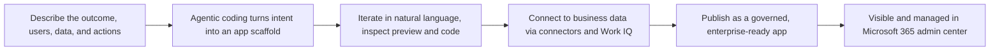

Microsoft is introducing **natural language app building** in both **Copilot Cowork** and **Copilot Studio**, letting people describe a business outcome in conversation and get a working, governed enterprise app.

## How it works

## Availability

- In **Copilot Cowork**, app building is available today via the **/app skill**, through the Microsoft Frontier program.
- In **Copilot Studio**, building apps alongside agents and workflows is **rolling out in public preview over the next week**.

## Enterprise controls built in

Apps are full-stack, built on open standards, and support Git-backed source control, deployment stages, and version isolation. By default they respect **Microsoft Entra identity** and organizational data/connector policies, and IT administrators get centralized visibility and lifecycle controls in the **Microsoft 365 admin center**. Published apps can also be discovered at managedapps.cloud.microsoft.com, and app building/running follows the usage-based Copilot Credits billing model.

- Source: [Build apps in Copilot Cowork and Copilot Studio](https://www.microsoft.com/en-us/microsoft-copilot/blog/copilot-studio/build-apps-in-copilot-cowork-and-copilot-studio/)
- Official documentation: [Add Work IQ to your Copilot Studio agent](https://learn.microsoft.com/en-us/microsoft-copilot-studio/add-work-iq)
