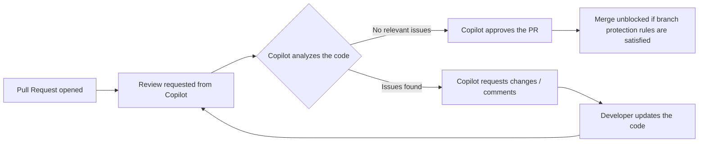

As of September 1, 2026, **Copilot code review** can, in addition to commenting and requesting changes, **formally approve a pull request**, effectively acting as a human reviewer for GitHub's branch protection rules.

## What changes in the review flow

Previously, Copilot could only leave comments or flag issues, always leaving the final approval to a person. With this update, if the automated review finds no relevant issues, Copilot can now close the review loop formally, unblocking the merge in repositories that require an approval as a mandatory condition.

## Other related recent updates

In the same period, GitHub also made new models directly available in Copilot, including **GPT-6 Astra** (generally available since September 4, 2026) and **Gemini 3.8 Flash** (since September 3, 2026), expanding the model options usable in chat and agent sessions.

- Primary source: [Copilot code review can now approve pull requests](https://github.blog/changelog/2026-09-01-copilot-code-review-can-now-approve-pull-requests)
- [GPT-6 Astra is generally available in GitHub Copilot](https://github.blog/changelog/2026-09-04-gpt-6-astra-is-generally-available-in-github-copilot)
- [Gemini 3.8 Flash is now available in GitHub Copilot](https://github.blog/changelog/2026-09-03-gemini-3-8-flash-is-now-available-in-github-copilot)
- Official documentation: [GitHub Copilot code review](https://docs.github.com/en/copilot)
