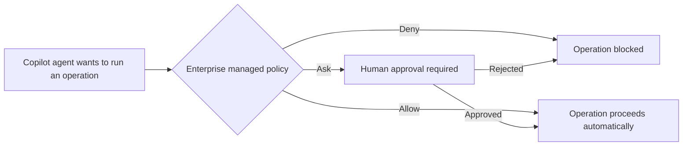

GitHub Copilot Business and Copilot Enterprise administrators can now **centrally control which agent operations are blocked, require human approval, or can proceed without a prompt**.

## What the managed permissions cover

Managed permissions apply to three categories of agent activity: **shell commands**, **file reads and edits**, and **network domains**. This gives administrators fine-grained guardrails for sensitive operations without disabling agent workflows altogether.

Critically, these restrictions **cannot be weakened** by user or workspace settings, auto-approval, or previously saved approvals — and administrators can define **specialized policies for different enterprise teams**.

## Where it's available

The controls are generally available in the **GitHub Copilot app**, **GitHub Copilot CLI**, and **Visual Studio Code** sessions that use Agent Host.

- Source: [Enterprise managed permissions for GitHub Copilot agent operations](https://github.blog/changelog/2026-09-09-enterprise-managed-permissions-for-github-copilot-agent-operations)
- Official documentation: [Enterprise managed permissions (deny/ask/allow)](https://docs.github.com/enterprise-cloud@latest/copilot/reference/enterprise-administrators/enterprise-managed-settings#deny-ask-allow)
