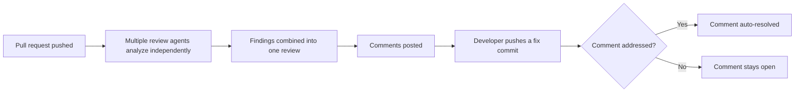

GitHub has shipped a set of updates to **Copilot code review** that change how review threads are managed and how thorough the reviews themselves are.

## Review experience updates

- **Automatic resolution of addressed comments**: when a later commit fixes the underlying feedback, Copilot now resolves that comment during its re-review, so open comments only reflect feedback that still needs attention.
- **Smart commit messages**: applying a Copilot autofix suggestion now generates a commit message based on what's actually changing, instead of a generic default.

## Analysis updates

- **Deeper analysis with shell tools**: Copilot code review now uses the full set of shell tools from the Copilot SDK (behind the Copilot agent firewall) to run build commands, execute tests, and retrieve information from available tools/APIs while validating code.
- **Ensemble of agents in Lite reviews**: the Lite effort level now combines findings from multiple agents into a single review instead of relying on one agent alone.

## Measured impact

According to GitHub's own experimentation, the ensemble approach in Lite reviews increased the average number of addressed comments per review by **47% for high severity findings, 31% for medium, and 11% for low**, while reducing review cost by about **8%**.

- Source: [Auto-resolution and analysis updates in Copilot code review](https://github.blog/changelog/2026-09-11-auto-resolution-and-analysis-updates-in-copilot-code-review)
- Official documentation: [GitHub Copilot code review](https://docs.github.com/en/copilot)
